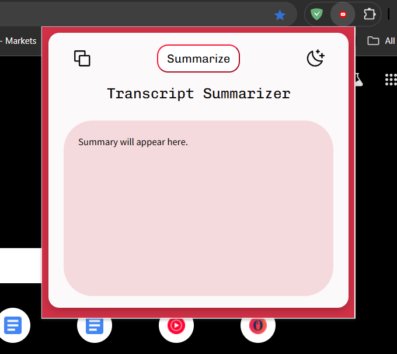
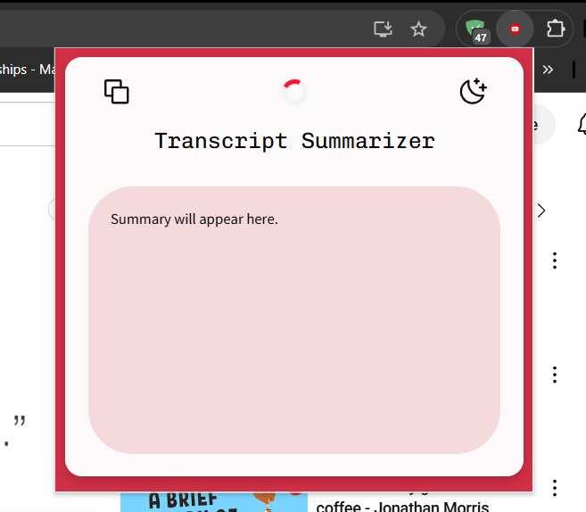
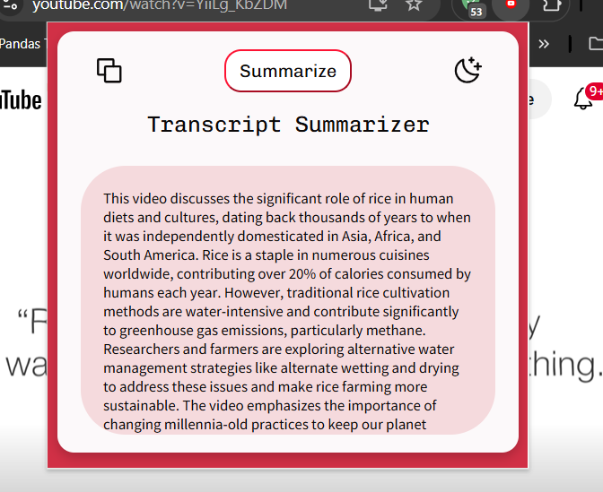
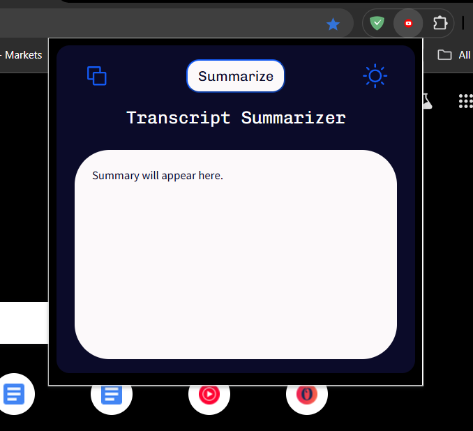
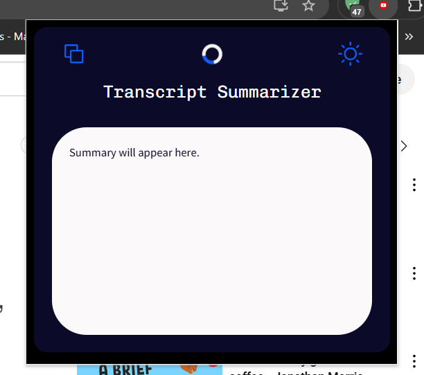
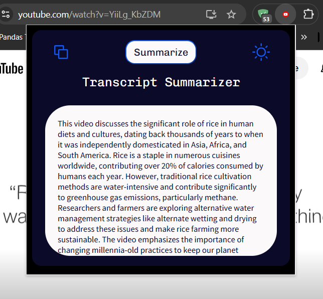

# YouTube Transcript Summarizer
A Chrome extension that allows you to summarize the transcript of the current YouTube video in your tab.

* This project uses the mistral:latest LLM model pulled from Ollama.
* The YT video link is fetched and validated using JavaScript.
* Transcript is extracted by using YT-DLP in ".vtt" format.
* By-passes CORS error by using mistral instead of transformers for summarization.
* The extension appears as a pop-up over the browser, making it easier for users to use.

Future Scope-
* Saving summaries in case the pop-up closes accidentally, allowing users to view them again.
* Reducing the time to render a summary (currently takes about 120 secs).

## Preview

 
 
 

Dark Theme-

 
 
 

